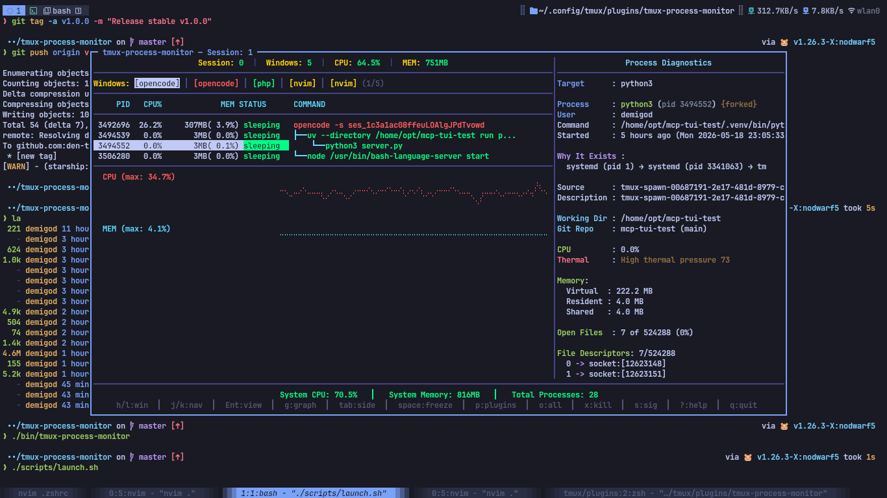
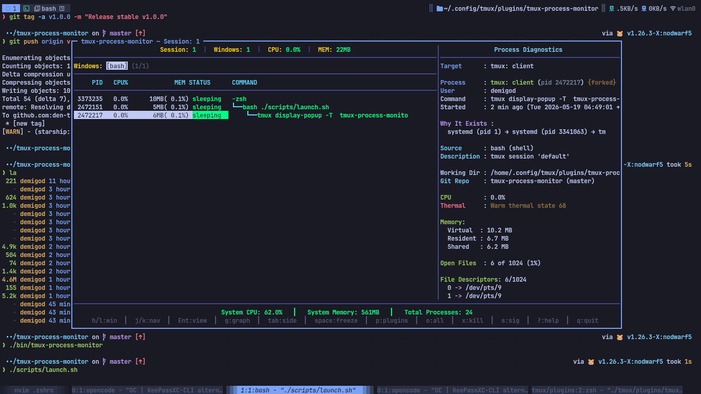
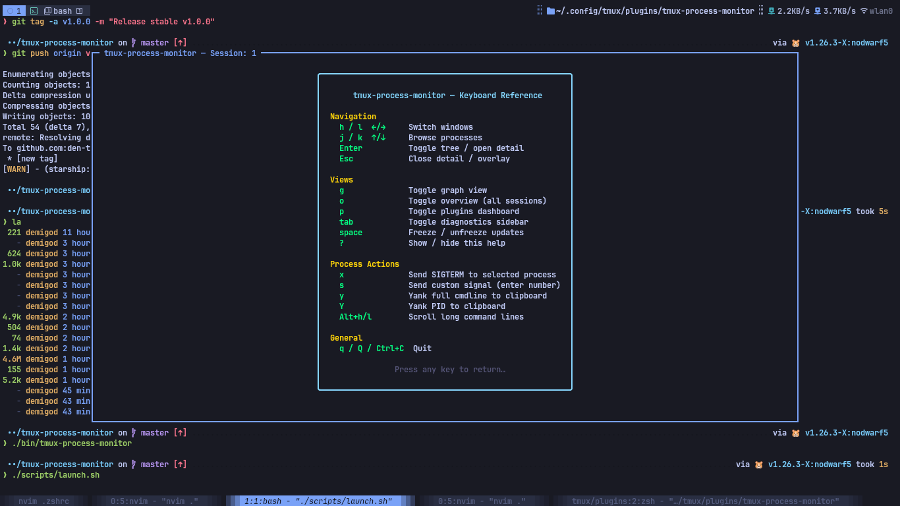
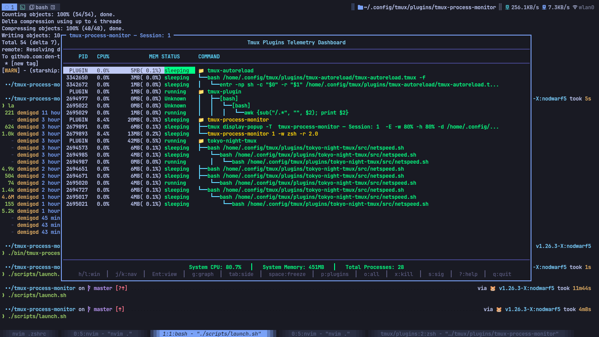

# 📊 tmux-process-monitor

A high-performance, visually stunning Terminal User Interface (TUI) process monitor and manager designed exclusively for **tmux** popups. Built with **Go** and the **Charm Bubble Tea** ecosystem, it combines extreme speed, thread-aware tree tracing, real-time telemetry sparklines, and a scrollable diagnostics panel into a beautiful, lightweight workspace helper.

---

## 📸 Screenshots

|      📈 Sparkline Graphs & Telemetry      |        🔍 Advanced Diagnostics Sidebar        |       ⌨️ Interactive Help Reference       |         🔌 Plugin Manager Integration         |
| :---------------------------------------: | :-------------------------------------------: | :---------------------------------------: | :-------------------------------------------: |
|  |  |  |  |

---

## ✨ Features

- **🚀 Lightning-Fast TUI:** Built using Go and Lipgloss with an extremely light memory footprint, delivering instant 60 FPS rendering within a tmux popup.
- **🌳 Thread-Aware Process Tree:** Traverses `/proc/PID/task/*/children` recursively to trace hidden children and multi-threaded runtime tasks (e.g., Node.js, Go, Java threads) that generic trees fail to capture.
- **📈 Live Sparkline Telemetry:** Renders real-time CPU and Memory usage history using Braille characters (NTCharts) in a toggleable split-graph view.
- **🔍 Scrollable Diagnostics Sidebar:** An interactive side panel that runs async `witr` diagnostics on the selected process.
  - Features **mouse wheel scrolling** directly over the sidebar.
  - Falls back to a custom, beautifully formatted process info view if `witr` is not installed.
  - Reset-on-navigation logic so that switching processes automatically scrolls the sidebar back to the top.
- **🌐 Multi-Session Telemetry:** Press `o` to enter a global dashboard view compiling aggregated performance telemetry (CPU%, memory, processes) across all active tmux sessions.
- **⚡ Seamless Window Swapping:** Retention algorithms prioritize immutable window indexes to keep your selected process tree pane stable while switching windows or scrolling.
- **🛡️ Process Control & Signal Firing:** Kill process trees instantly with `x` (SIGTERM) or fire custom signals with `s` (SIGKILL, etc.) from an inline input prompt.
- **📋 Clipboard Yanking:** Copy the raw PID or the complete, un-truncated Command Line of any process to your system clipboard instantly.

---

## 🛠️ Installation

### Option 1: Via TPM (Tmux Plugin Manager) — _Recommended_

Add the following to your `~/.tmux.conf` file:

```tmux
set -g @plugin 'den-tanui/tmux-process-monitor'
```

Press `Prefix` + `I` to fetch, build, and register the plugin.

### Option 2: Manual Installation

Clone the repository to your tmux plugins folder and build the binary:

```bash
mkdir -p ~/.config/tmux/plugins
git clone https://github.com/den-tanui/tmux-process-monitor ~/.config/tmux/plugins/tmux-process-monitor
cd ~/.config/tmux/plugins/tmux-process-monitor
make build
```

Then add this line to your `~/.tmux.conf`:

```tmux
run-shell ~/.config/tmux/plugins/tmux-process-monitor/tmux-process-monitor.tmux
```

Reload tmux with `tmux source-file ~/.tmux.conf`.

---

## ⚙️ Configuration

You can customize binding keys, sizing, and updates directly in your `~/.tmux.conf`.

| Option                               | Default | Description                                                       |
| ------------------------------------ | ------- | ----------------------------------------------------------------- |
| `@tmux_process_monitor_key`          | `t`     | Key to open the process monitor popup (toggle overview with `o`). |
| `@tmux_process_monitor_refresh_rate` | `2.0`   | Refresh rate in seconds.                                          |
| `@tmux_process_monitor_width`        | `80%`   | Width of the tmux popup window.                                   |
| `@tmux_process_monitor_height`       | `80%`   | Height of the tmux popup window.                                  |

#### Example Custom Configuration

```tmux
set -g @tmux_process_monitor_key 'p'          # Bind to 'p'
set -g @tmux_process_monitor_refresh_rate '1.0' # 1s updates
set -g @tmux_process_monitor_width '90%'        # Wider popup
```

---

## ⌨️ Keyboard Shortcuts

All controls are visually formatted in a centered bar at the bottom of the screen.

### Navigation & Views

- <kbd>h</kbd> / <kbd>l</kbd> or <kbd>←</kbd> / <kbd>→</kbd> : Switch tmux window tabs.
- <kbd>j</kbd> / <kbd>k</kbd> or <kbd>↑</kbd> / <kbd>↓</kbd> : Navigate up and down the process tree.
- <kbd>Enter</kbd> : Toggle tree nodes (collapse/expand children) / open full-screen `witr` view.
- <kbd>g</kbd> : Toggle split-graph mode showing CPU & Memory sparklines.
- <kbd>tab</kbd> : Toggle the diagnostics sidebar panel on/off.
- <kbd>o</kbd> : Toggle global overview (all active tmux sessions).
- <kbd>?</kbd> : Show or hide the Keyboard Reference overlay.
- <kbd>Esc</kbd> : Close overlays, detail view, or cancel signals.

### Actions & Clipboard

- <kbd>x</kbd> : Send a `SIGTERM` to the selected process.
- <kbd>s</kbd> : Prompt for a custom signal number (e.g. `9` for SIGKILL).
- <kbd>y</kbd> : Yank the un-truncated full command line to the system clipboard.
- <kbd>Y</kbd> : Yank the selected process PID to the system clipboard.
- <kbd>Alt</kbd>+<kbd>h</kbd> / <kbd>l</kbd> : Scroll long command lines horizontally.

---

## 💡 System Requirements

- **OS:** Linux (relies on `/proc` scanning).
- **tmux:** 3.2+ (for popup support).
- **Go:** 1.21+ (if compiling from source).
- **`witr` (Optional):** Install [witr](https://github.com/pranshuparmar/witr) for full verbose process diagnostics in the sidebar. If not installed, a detailed telemetry fallback pane is seamlessly rendered.

---
## TODO
- Better way to discover/parse plugins
- Search feature and bar
- Open popup focused on current window processes
- Popup for signals
- Adjust niceness
- Show nice value in process view
- Switch to tmux session+window/pane
- Shortcut to pause/resume a process (send sigs)

## 💡 Inspiration

- Based entirely on [tmux-task-monitor](https://www.github.com/YlanAllouche/tmux-task-monitor) - Original layout and code written in python

## 📄 License

This project is licensed under the [MIT License](LICENSE).
